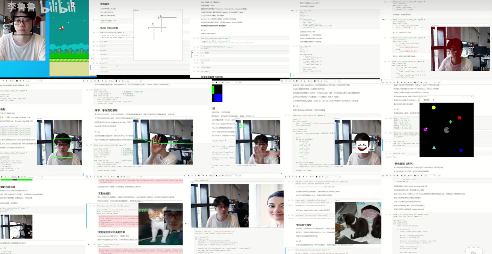

# 李鲁鲁老师的Copilot-Python学习

旨在帮助更多的同学学会使用ChatGPT、Copilot等工具，用Python开发多样化的程序。

这是一个在建的课程项目 预计第一学期会有16节课，每节课的课时在40分钟，额外扩充40分钟的练习实践

这门课程的目标受众，是一个刚接触Python编程的中学生，或者一个对编程了解较少的非计算机专业的同学。

课程会首先使用中文，如果项目有很多人关注的话，会翻译到其他语言。

This is a project for a course project. The course will have 16 lessons, each lesson will be 40 minutes long. There will be 40 minutes of practice and exercises. 

The course will be taught in Chinese, if there is enough interest, I will translate the course into other languages.

# Hiring

- 课程测试者
- 头部学校老师进行实验和合作
- 衍生课程的开发人员

# TODO List

- [ ] 编写第五课
- [ ] 扩充提纲

# 课程提纲( 在建 )

## 第一课，引言

- 在有Copilot的情况下，Python学习有什么不同
- 开发这门课程的动机说明
- 什么样的开发项目会选用Python
- Notebook的使用说明

## 第二课，分支语句，与人脸检测实践

## 第三课，做一个键盘乐器

## 第四课，基础的数据结构讲解和Excel可视化

## 第五课，对函数的描述，编写更复杂的游戏

## 第六课，类

## 第七课，调用大语言模型的API

## 第八课，编写简单的交互界面

## 后续

- 包含一节密码的课程
- 包含一节物理模拟
- 包含一节双文件夹图片机器学习的课程
